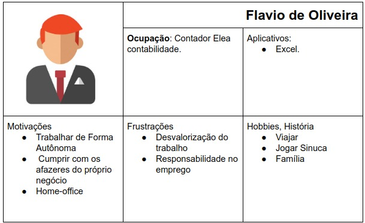
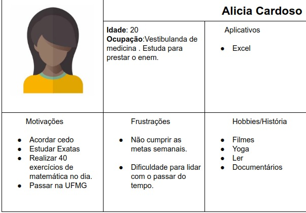
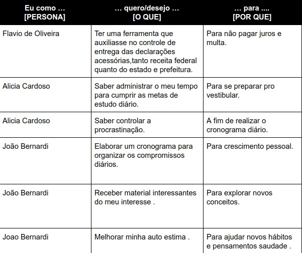
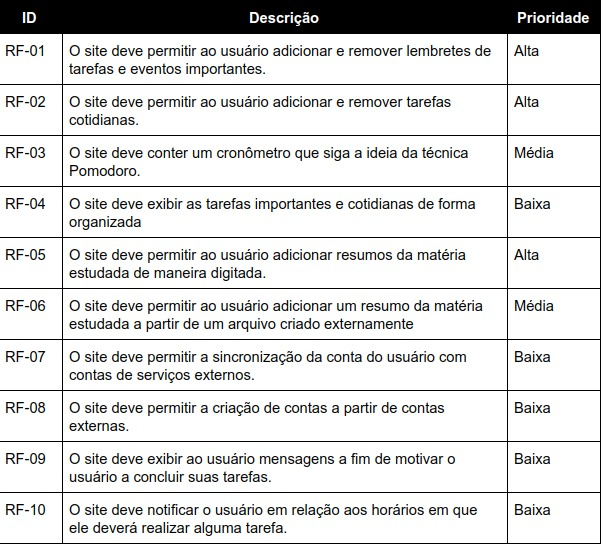
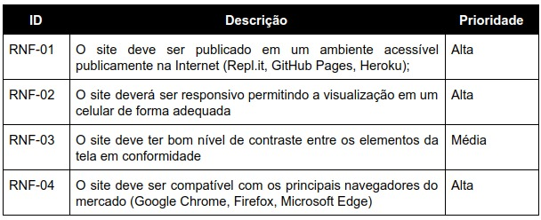
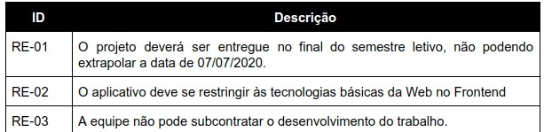

# Especificações Do Projeto

Pré-requisitos: <a href="1-Contexto.md"> Documentação de Contexto</a>

> Apresenta uma visão geral do que será abordado nesta parte do
> documento, enumerando as técnicas e/ou ferramentas utilizadas para
> realizar a especificações do projeto

## Personas

## Histórias de Usuários

## Requisitos

As tabelas que se seguem apresentam os requisitos funcionais e não funcionais que detalham o escopo do projeto.

### Requisitos Funcionais

### Requisitos não Funcionais

## Restrições

O projeto está restrito pelos itens apresentados na tabela a seguir.

