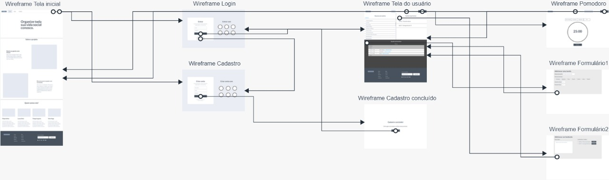
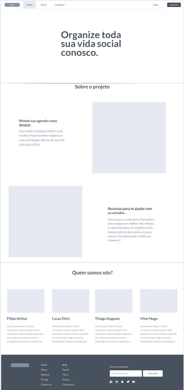
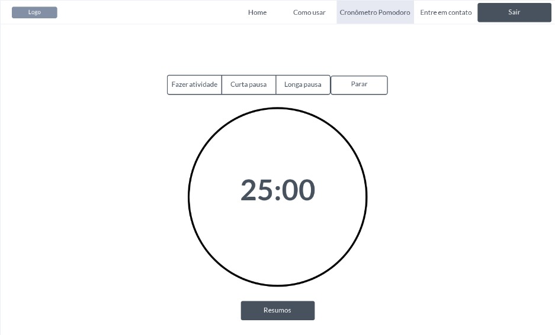
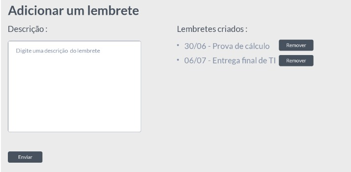
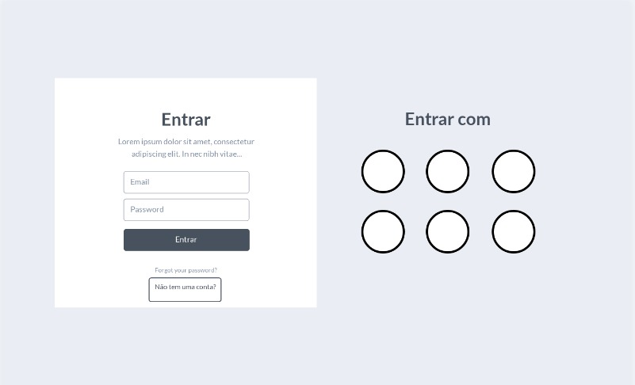

# Projeto de Interface

Pré-requisitos: <a href="2-Especificação.md"> Documentação de Especificação</a>

> Apresentamos aqui as principais a interface da plataforma.Elaborada de
> de forma a atender os requisitos funcionais, não funcionais e histórias
> de usuário abordados nas [Especificações do Projeto](2-Especificação.md).

## User Flow

> Fluxo de usuário (User Flow) é uma técnica que permite ao desenvolvedor
> mapear todo fluxo de telas do site ou app.

## Wireframes

> Home

> Pomodoro

> Lembrete

> Login

> São protótipos usados em design de interface para sugerir a
> estrutura de um site web e seu relacionamentos entre suas
> páginas
