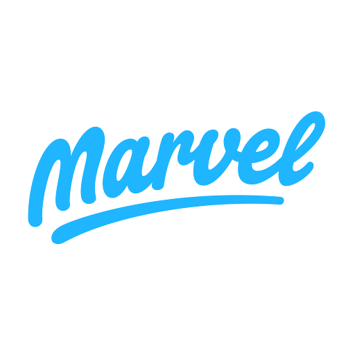

# Gerenciamento de Projeto

> Aqui discutimos a metodologia de trabalho do grupo desenvolver o
> problema.

## Divisão de Papéis

A divisão de papéis entre os membros do grupo:
Scrum Master:

- Vitor Hugo
  Product Owner:
- Filipe Arthur

  Equipe de Desenvolvimento

- Filipe Arthur
- Lucas Diniz
- Thiago Leão
- Vitor Hugo

  Equipe de Design

- Filipe Arthur

## Processo

Aqui ira informações sobre detalhes da implementação do Scrum seguido pelo grupo.

O grupo utilizou o Trello para acompanhar o andamento do projeto, a execução das tarefas e o status de desenvolvimento da solução, sendo que, a equipe está estruturada com as seguintes listas:

- Resource: esta lista mantém template de tarefas recorrentes com as configurações padronizadas que todos devem seguir. O objetivo é permitir a cópia destes templates para agilizar a criação de novos cartões.
  A tarefas são, ainda, etiquetadas em função da natureza da atividade e seguem o seguinte esquema de cores/categorias:

  

- Backlog: recebe as tarefas a serem trabalhadas e representa o Product Backlog. Todas as atividades identificadas no decorrer do projeto também devem ser incorporadas a esta lista e categorizadas por nível de prioridade. Quando mais em cima mais importante é essa função
- ToDo: Esta lista representa o Sprint Backlog. Este é o Sprint atual que estamos trabalhando., ou seja, são as funções para a próxima entrega
- Analyze: São funções ainda em análise de como será desenvolvido. por exemplo em estudo da viabilidade dela
- Dev: Quando uma tarefa tiver sido iniciada, ela é movida para cá.
- Test: Checagem de Qualidade. Quando as tarefas são concluídas, eles são movidas para ele, assim. Esses testes também são feitos em grupo durante nossa reunião
- Done: nesta lista são colocadas as tarefas que passaram pelos testes e estão prontos. Não há mais edições ou revisões necessárias, ele está agendado e pronto para a ação.
- Locked: Quando alguma coisa impede a conclusão da tarefa, ela é movida para esta lista
  > O quadro kanban do grupo no Trello está disponível através da URL e é apresentado, no[Link Trello](https://trello.com/b/KTFzQngz/organização-da-rotina) estado atual. A definição desta estrutura se baseou na proposta feita por Rommel(2020).

## Ferramentas

As ferramentas empregadas no projeto são:

- Editor de código: - Visual Studio Code, pois tem possui uma integração com o sistema de versão, além de simples e bonito
- Ferramentas de comunicação
  - Microsoft Teams, para uma comunicação durante distanciamento social, sendo uma tecnologia já usada durante a aulas da PUC-Minas
  - WhatsApp, para comunicação mais rápida e pontual
  - Ferramentas de diagramação
  - MarvelApp, para wireframes já interativos assim podemos ter uma prévia do que o site vai se formar

> Lista de quais ferramentas foram empregadas no desenvolvimento do
> projeto
>
> **Ferramentas que auxiliaram no gerenciamento**:
>
> - 
>
> Usada com o Scrum é perfeito para a acompanhar o andamento do projeto, a execução das tarefas e o status de desenvolvimento da solução
>
> - 
>
>   Usada para comunicação e gestão do time
>
> - 
>
>   Usado para wireframes já interativos
