# Organização de rotina

**Daniel Soares França**
**Lucas Diniz de Moraes**
**Filipe Arthur Ferreira Silva**
**Thais Camila Gonçalves costa, thaiscamilacc@gmail.com**

---

_Curso de Ciência da Computação, Unidade {Coração Eucarístico | Praça da Liberdade}_

_Instituto de Informática e Ciências Exatas – Pontifícia Universidade de Minas Gerais (PUC MINAS), Belo Horizonte – MG – Brasil_

---

Nosso objetivo é que o usuário atinja o máximo rendimento em suas tarefas com nosso site. Em uma pesquisa realizada pelo grupo no primeiro semestre de 2020 as pessoas apontam como principal problema a dificuldade de organizar a rotina, conciliar escola e tarefas de casa e colocar a matéria vista em dia, problemas agravados por questões como procrastinação, questões financeiras e psicológicas, então nosso objetivo geral e ter uma aplicação web que ajude-os a se organizar

---

**1. Introdução**

**1.1 contextualização**
No livro O Poder do Hábito de Charles Duhigg é apresentada uma teoria de um loop do hábito, na qual, o funcionamento de todos nossas atividade rotineiras passariam esse loop, que começa com uma deixa, que é um ativador da rotina, a rotina sendo a atividade propriamente dita, e gerando um recompensa, porém grande parcela da sociedade apresenta dificuldades para organizar seu dia ,ou seja, construir esse loop de maneira positiva. Afinal, em uma sociedade corridas em que todos nós temos de ser multitarefas, é difícil para essas pessoas terem tempo para se organizar.
	Tendo isso em mente, fizemos uma pesquisa de campo com um questionário (em que recebemos 19 respostas de estudantes da PUC, UFMG, Coltec e estudantes de vestibular) e uma enquete em uma rede social (em que recebemos 11 respostas).
	A maioria das respostas apontam como principal problema desse grupo a dificuldade de organizar a rotina, conciliar escola e tarefas de casa e colocar a matéria vista em dia, problemas agravados por questões como procrastinação, questões financeiras e psicológicas.
No formulário também foi perguntado se as pessoas utilizam algum software que auxilie na organização. Nesse maior destaque vai ás pessoas que não utilizam esses serviços, que compõem mais de 60% das respostas

   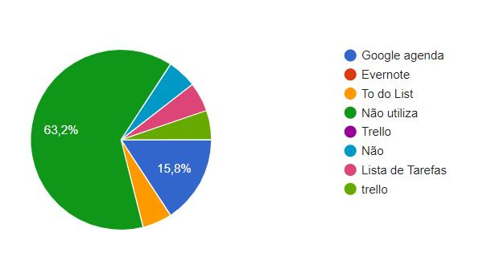

**1.2 Problema**
Conforme exposto, o problema que se busca resolver com este projeto é que o nosso usuário seja capaz de atingir o máximo rendimento em suas tarefas diárias , produzindo um crescimento constante pessoal para se tornar uma pessoa melhor.

**1.3 Objetivos gerais**
Criar uma aplicação web que ajude o usuário a organizar sua rotina, auxiliando na conciliação entre tarefas acadêmicas e pessoais, evidenciando também eventos e tarefas futuras importantes.
Como objetivos específicos, podemos ressaltar:
- **1.3.1** Disponibilizar uma agenda para organização da rotina. 
- **1.3.2** Salvar resumos de matéria estudada (técnica Feynman)
- **1.3.3** Cronômetro Pomodoro: Auxilia o usuário a organizar o tempo.

**1.4 Justificativas**
Após pesquisa de campo por diversas redes sociais ,foi verificado em nossos questionários que a grande maioria dos entrevistados têm dificuldade para organizar a rotina. Seja para estabelecer prioridades ,falta de motivação para comprir tarefas ,tempo diário mal utilizado, falta de persistência e entre outros.

**2. Projeto da Solução**
O escopo funcional do projeto é definido por meio dos requisitos funcionais que descrevem as possibilidades interação dos usuários, bem como os requisitos não funcionais que descrevem os aspectos que o sistema deverá apresentar de maneira geral. Estes requisitos são apresentados a seguir.

    2.1. Requisitos funcionais
	
A tabela a seguir apresenta os requisitos do projeto, identificando a prioridade em que os mesmos devem ser entregues.

| No.           | Descrição                       | Prioridade |
| ------------- |:-------------------------------:| ----------:|
| RF-01 | O site deve permitir ao usuário adicionar e remover lembretes de tarefas e eventos importantes | Alta |
| RF-02 | O site deve permitir ao usuário adicionar e remover tarefas cotidianas. | Alta |
| RF-03 | O site deve conter um cronômetro que siga a ideia da técnica Pomodoro.  | Média | 
| RF-04 | O site deve exibir as tarefas importantes e cotidianas de forma organizada | Baixa |
| RF-05 | O site deve permitir ao usuário adicionar resumos da matéria estudada de maneira digitada. | Alta |
| RF-06 | O site deve permitir ao usuário adicionar um resumo da matéria estudada a partir de um arquivo criado externamente  | Média | 
| RF-07 |O site deve permitir a sincronização da conta do usuário com contas de serviços externos. | Baixa |
| RF-08 | O site deve exibir ao usuário mensagens a fim de motivar o usuário a concluir suas tarefas.  | Baixa |
| RF-09 |  O site deve permitir a criação de contas a partir de contas externas. | Baixa |
| RF-10 | O site deve notificar o usuário em relação aos horários em que ele deverá realizar alguma tarefa. | Baixa | 

**2.2. Requisitos não funcionais**

A tabela a seguir apresenta os requisitos não funcionais que o projeto deverá atender.

| No.           | Descrição                       | Prioridade |
| ------------- |:-------------------------------:| ----------:|
| RNF-01 |O site deve ser publicado em um ambiente acessível publicamente na Internet (Repl.it, GitHub Pages, Heroku); | Alta |
| RNF-02 |O site deverá ser responsivo permitindo a visualização em um celular de forma adequada. | Alta |
| RNF-03 | O site deve ter bom nível de contraste entre os elementos da tela em conformidade  | Média | 
| RNF-04 | O site deve ser compatível com os principais navegadores do mercado (Google Chrome, Firefox, Microsoft Edge) | Alta |
	
**2.2. Restrições**

As questões que limitam a execução desse projeto e que se configuram como obrigações claras para o desenvolvimento do projeto em questão são apresentadas na tabela a seguir.

| No.           | Descrição                       |
| ------------- |:-------------------------------:|
| RE-01 |O projeto deverá ser entregue no final do semestre letivo, não podendo extrapolar a data de 30/11/2020. |
| RE-02 |O aplicativo deve utilizar tecnologias básicas da Web no Frontend e programação Backend, utilizando Banco de dados e Sistemas Inteligentes |
| RE-03 | A equipe não pode subcontratar o desenvolvimento do trabalho. | 

    2.2. Tecnologias

- Desenvolvimento web: HTML, CSS, JAVASCRIPT - utilizados para construir o front-end do site 

- Back-end: Java - utilizados para construir o Back-end do site 

- Back-end: PostgreSQL - sistema gerenciador de banco de dados do site 

- Back-end: MAVEN -  ferramenta de automação de compilação utilizada primariamente em projetos Java. 

  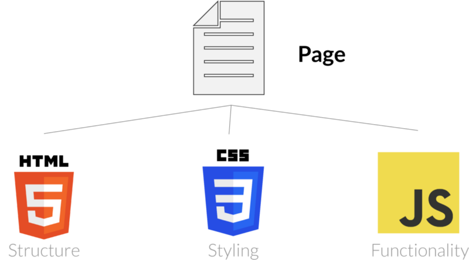
  
  
  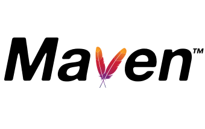

	
**3. Modelagem de dados**

Apresente o modelo de dados. Defina o dicionário de dados com os respectivos formatos e significados.

    3.1. Diagrama de Entidade-Relacionamento

Apresente a estrutura das tabelas de banco de dados no modelo Diagrama de Entidade-Relacionamento. 
A Seguir, segue um exemplo de imagem adicionada ao documento.

**4. Sistema desenvolvido**

- **Tela de Login e Cadastro**

Esse é a tela onde a pessoas, na qual, já possuem conta entram nela atraves do usuário e sua senha, já armazenados no localStorage, e os que não podem cadastrar-se através de um PopUp, aberto ao clicar no botão de novo usuário. Nesse popUp deve ser colocado 
usuário, nome completo, email e senha e assim por sua vez será também salvo localmente. Fora isso no botão cancelar para voltar para home  home.

  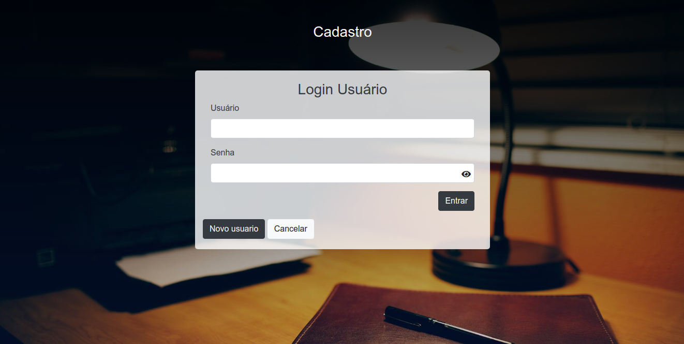
  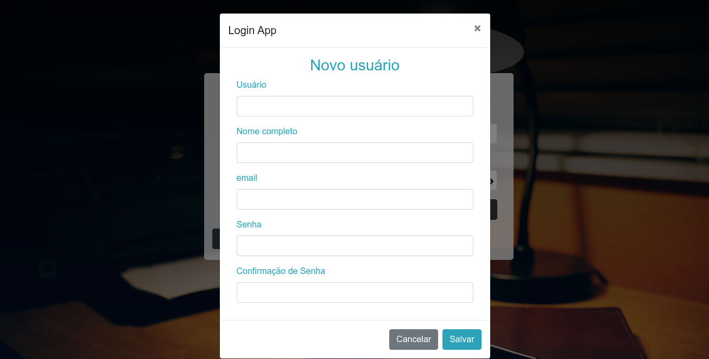
 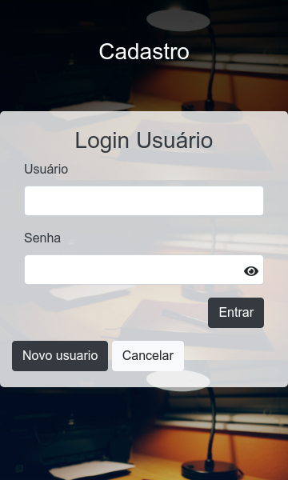
 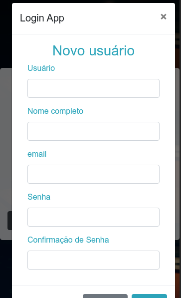

- **Tela de Pomodoro**

A tela apresenta um cronômetro que utiliza a técnica pomodoro, assim a pessoa pode executar a tarefa por 25 minutos, sendo que, após tem  pausas curtas de 5 minutos, e após 4 pausar curtas tem uma longa de 15 minutos. Nessa página também após a execução da tarefa a pessoa tem a possibilidade de fazer um resumo bem básico da matéria na qual ele estudou, seguindo a técnica de Feynman. Fora isso na área lateral é onde o estudante pode voltar para a home, ir para ver todos seus resumos, suas tarefas ou uma página informativa sobre o projeto

  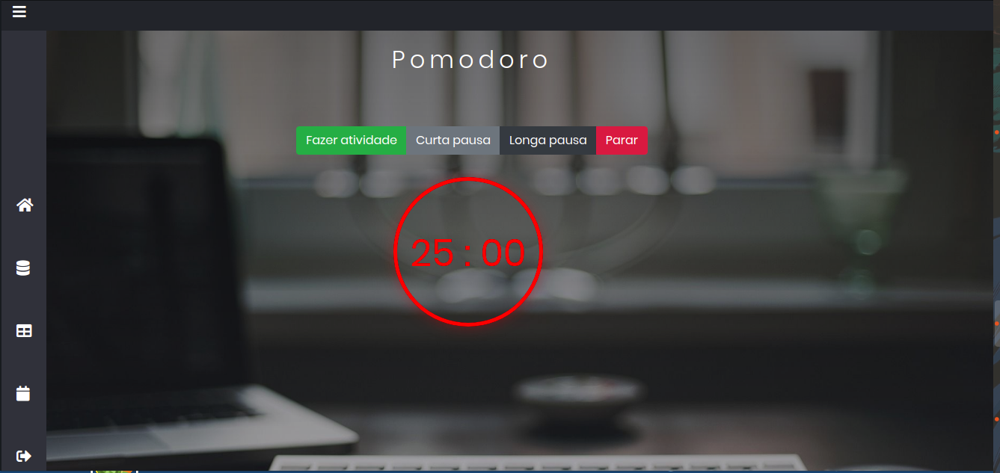
  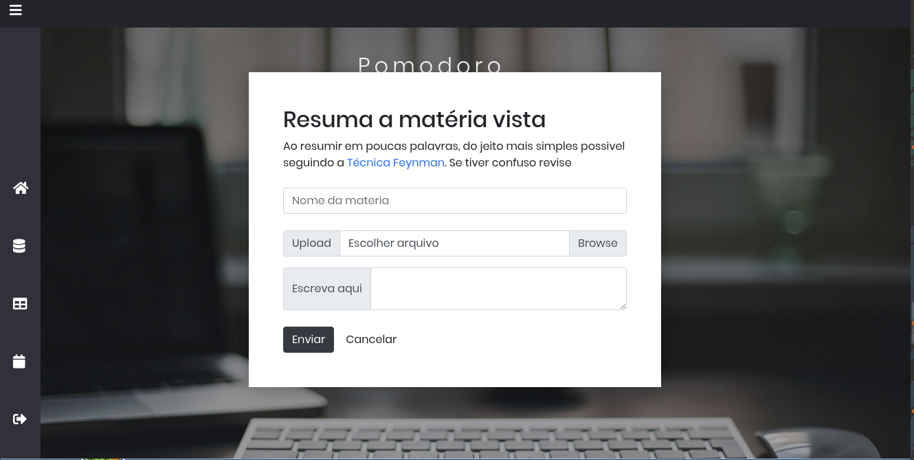
 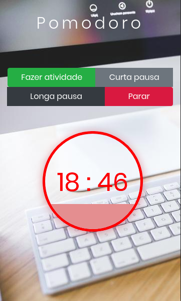

- **Quadro de horários**

O quadro de horários é um carrossel com 7 partes, cada uma exibindo as tarefas cotidianas do usuário em um determinado dia da semana. Há também um pequeno formulário para adicionar uma nova tarefa, e ao lado de cada atividade há um link que, se clicado, remove a tarefa do quadro (Obs : se a tarefa deletada ocorrer em mais de um dia, ela será removida de todos os dias).

  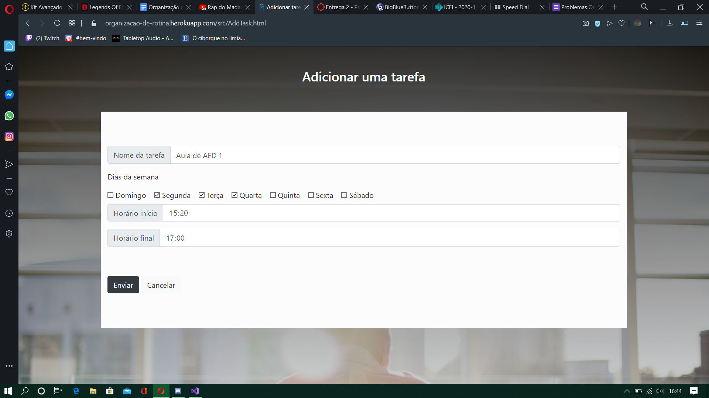
  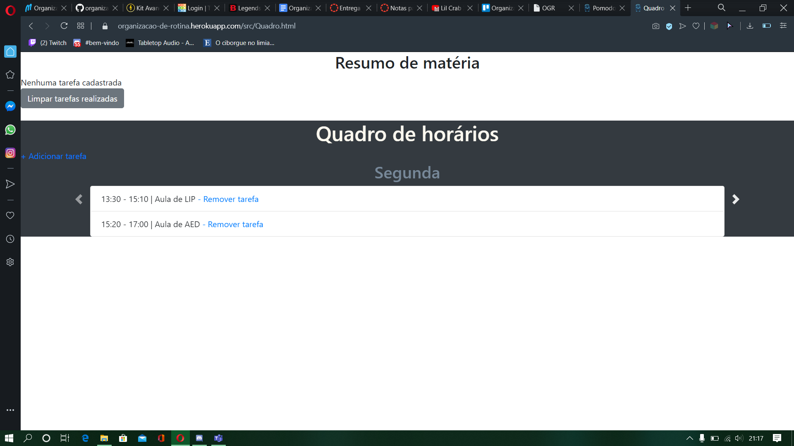
 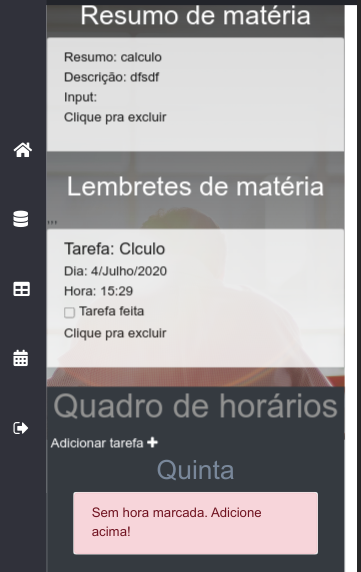

- **Tela de Lembrete**

A tela apresenta um meio das pessoas adicionar tarefas, no qual, acontecem apenas uma vez e em determinado dia. Assim o usuário coloca o nome da lembrete, descrição, data do lembrete e a hora que irá acontecer,essas informações são salvas no localStorage. Ao fazer isso é criado ao lado uma lista dos lembretes contendo essas informações, cada elemento dessa lista ao ser clicado o lembrete é excluído, portanto tornando mais dinâmica o modo de manipular os mesmos. Fora isso na área lateral é onde o estudante pode voltar para a home, ir para ver todos seus resumos, suas tarefas ou uma página informativa sobre o projeto.

  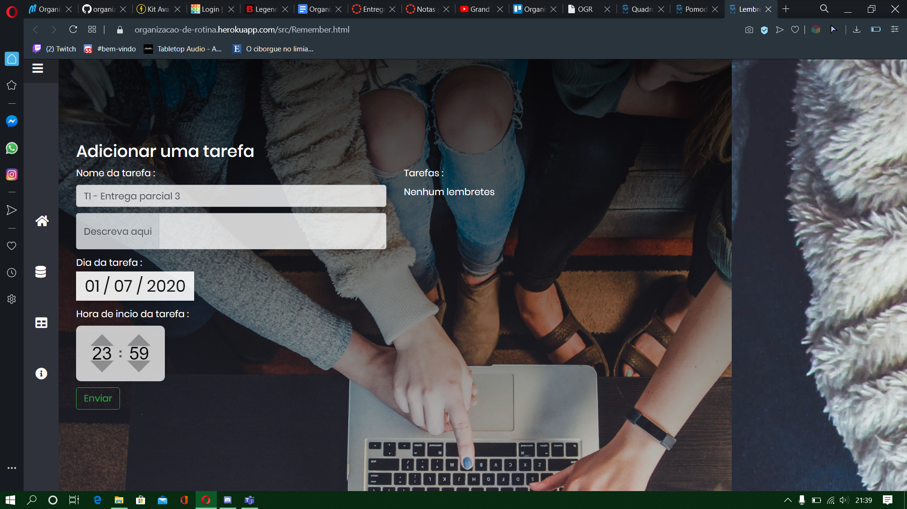
  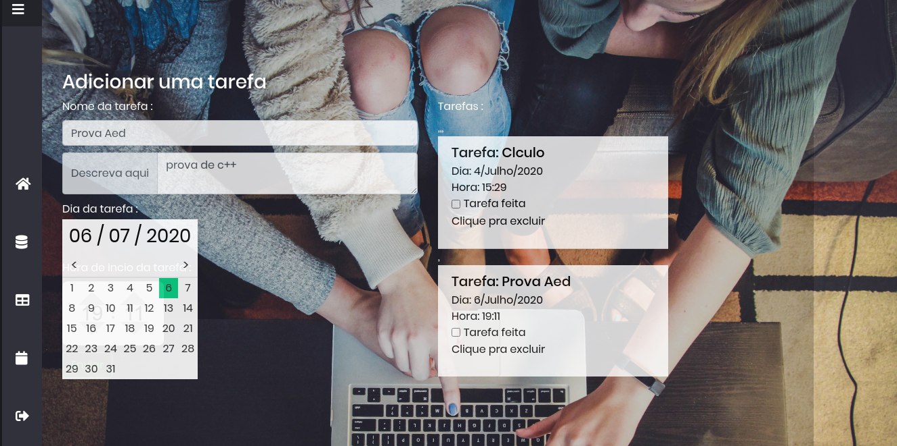
 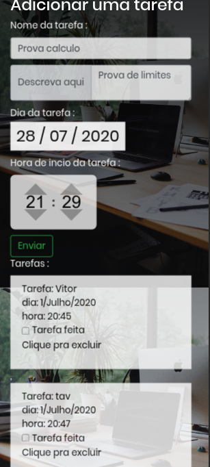

**5. Avaliação**

Faça aqui sobre a avaliação do software. Indique se ele atendeu as expectativas e ele é viável. 
Para não ficar subjetivo, o ideal é fazer um questionário e pedir ao usuário do processo que faça a avaliação.

**6. Conclusão**

Apresente aqui a conclusão do seu trabalho. Discussão dos resultados obtidos no trabalho, onde se verifica as 
observações pessoais de cada aluno. Poderá também apresentar sugestões de novas linhas de estudo.  

**REFERÊNCIAS**

**[1.1]** - _Bakshy, E.; Messing, S.; Adamic, L. A. Exposure to ideologically diverse news and opinion on Facebook. Science. 2015.._

**[1.2]** - _Littlefield, A. Guia da metodologia ágil e scrum para iniciantes. 2016. Disponível em: https://blog.trello.com/br/scrum-metodologia-agil. Acessado em 26/05/2020.._

**[1.3]** - _Newman, N.; Fletcher, R.; Kalogeropoulos, A.; Nielsen; R. K. Reuters Institute Digital News Report 2019.  Reuters Institute for the Study of Journalism. 2019. Disponível em: https://reutersinstitute.politics.ox.ac.uk/sites/default/files/2019-06/DNR_2019_FINAL_0.pdf. Acessado em 26/05/2020._

**[1.4]** - _Vietro, I. L. Fluxo de desenvolvimento com GitFlow. 2015. Disponível em: https://imasters.com.br/agile/fluxo-de-desenvolvimento-com-gitflow. Acessado em 26/05/2020._
